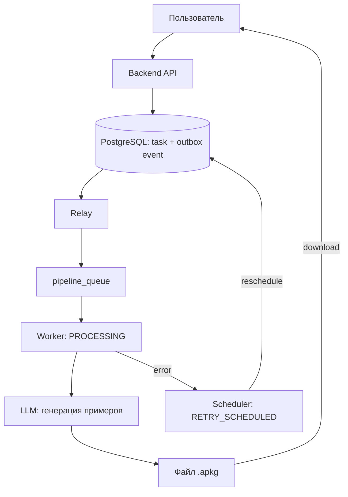

# DeckForge

DeckForge — сервис для изучающих иностранные языки. Вводите слова, выбираете язык и уровень сложности, и сервис собирает колоду карточек Anki: для каждого слова подбираются примеры предложений с переводом. Готовый файл импортируется в Anki.

## Как это работает



## Стек

Python · FastAPI · PostgreSQL · RabbitMQ · React · OpenAI API

## Запуск

```bash
docker compose up --build
```

Перед запуском создайте в корне проекта файл `.env` с ключами для LLM и Google OAuth (список переменных есть в `src/deckforge/config.py`). Интерфейс будет доступен на `http://localhost:5173`.
